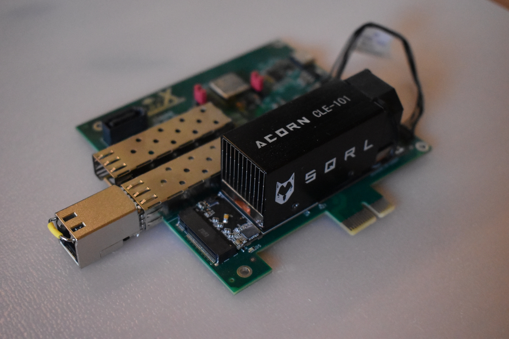

                                  __   _ __      _  __    ___
                                 / /  (_) /____ | |/_/___/ _ |_______  _______
                                / /__/ / __/ -_)>  </___/ __ / __/ _ \/ __/ _ \
                               /____/_/\__/\__/_/|_|__ /_/ |_\__/\___/_/ /_//_/
                                 / _ )___ ____ ___ / /  ___  ___ ________/ /
                                / _  / _ `(_-</ -_) _ \/ _ \/ _ `/ __/ _  /
                               /____/\_,_/___/\__/_.__/\___/\_,_/_/  \_,_/
                                    Copyright 2021-2024 / Enjoy-Digital

[> Intro
--------

The LiteX-Acorn-Baseboards are baseboards developed around the SQRL's Acorn board (or Nite/LiteFury) expanding their possibilities with:

**Mini variant:**



- A PCIe X1 connector.
- 2 SFP connectors.
- A SATA connector.
- A JTAG/UART port.

**Standard variant:**


- A PCIe X1 connector.
- A SFP connector.
- A M2 SATA slot.
- An EPC5 FPGA (connected to the Acorn through a SerDes link) and providing:
- A JTAG/UART port.
- A 1Gbps Ethernet port (RGMII).
- A HDMI Out port.
- A SDCard slot.
- 4 PMODs.
- 2 Buttons.
- A LCD.
- 2 SATA connectors (connected to the ECP5's SerDeses).

The boards are mainly intended to be used as a development boards for LiteX: From regression testing
to development of new features; but can also be a nice and cheap FPGA development board for
developers willing to play with PCIe, SFP, SATA, etc... or wanting to create an standalone and open
source Linux platforms.

The development has been specified and funded by Enjoy-Digital (@enjoy-digital); also doing the
HDL/Gateware development. The schematic/pcb has been designed by Ilia Sergachev (@sergachev) who
also assembled the initial prototypes.


[> Availability/Price
---------------------

Small batchs of the Mini variant are currently produced and available on our webshop:
https://enjoy-digital-shop.myshopify.com/

The Standard variant is currently used for internal R&D and it still has to be decided if it will be
produced.

The aim of the boards is to allow new kinds of designs with LiteX and to also enable users to play
more easily with the framework, experiment with it and eventually contribute. **We are producing
the boards and selling them more to enable others to also have fun with them and explore
LiteX/SerDes based cores than to make a living**, so batches are of limited size and still need to
be assembled partially manually, so even if we are trying ot be reactive on this, **there could be a
bit of delay between batches (1 month) and a few days between order and expedition**.

[> Validation Status
--------------------

**Mini variant:**
- [X] PCIe Gen2 X1.
- [X] JTAG.
- [X] UART.
- [X] SFPs.
- [X] SATA.

**Standard variant:**
- [X] PCIe Gen2 X1.
- [X] SFP.
- [X] M2 SATA SSD.
- [X] ECP5 JTAG/UART.
- [X] Acorn JTAG.
- [ ] Acorn/ECP5 Fast Link.
- [X] Acorn/ECP5 Slow Link (2 of 4 lines tested).
- [X] ECP5 boot control from Acorn via I2C.
- [X] 1Gbps Ethernet.
- [X] HDMI Out.
- [X] SDCard.
- [X] 4X PMODs.
- [X] 2X Buttons.
- [X] SSD1306 LCD.
- [ ] 2X ECP5 SATA.

[> Prerequisites
----------------
- Python3, Vivado.
- JTAG HS2 cable (or OpenOCD compatible cable).

[> Installing LiteX
-------------------
```sh
$ wget https://raw.githubusercontent.com/enjoy-digital/litex/master/litex_setup.py
$ chmod +x litex_setup.py
$ sudo ./litex_setup.py init install
```
... or follow the installation instructions if the LiteX Wiki: https://github.com/enjoy-digital/litex/wiki/Installation

[> Designs/Apps
---------------

**Mini variant:**
- LiteX-Boards support with SoC/DRAM/PCIe/Ethernet/SATA support:
https://github.com/litex-hub/litex-boards/blob/master/litex_boards/targets/litex_acorn_baseboard_mini.py
- LiteX-HW-CI tests running Linux on it with VexRiscv, NaxRiscv (32 or 64-bit) or Rocket CPUs:
https://github.com/enjoy-digital/litex_hw_ci/blob/main/configs/test_linux_acorn.py
- Bringup tests: https://github.com/enjoy-digital/litex-acorn-baseboard/tree/master/bringup/mini
- + More to come! :)

[> Contact
-------------
E-mail: florent@enjoy-digital.fr