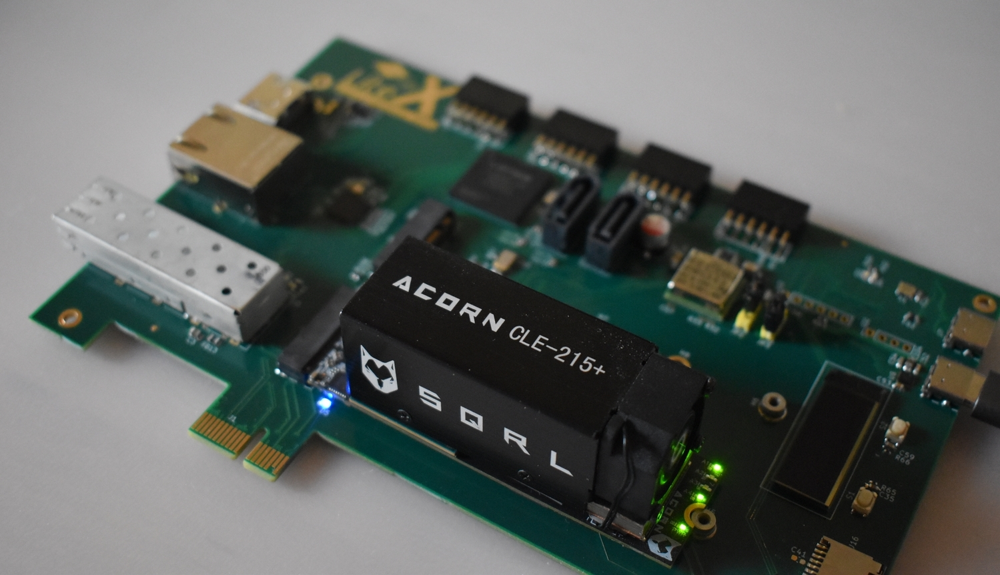
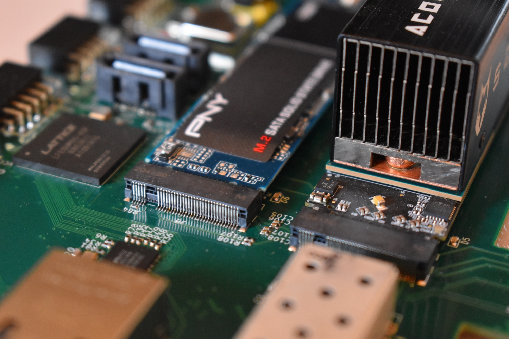

                                  __   _ __      _  __    ___
                                 / /  (_) /____ | |/_/___/ _ |_______  _______
                                / /__/ / __/ -_)>  </___/ __ / __/ _ \/ __/ _ \
                               /____/_/\__/\__/_/|_|__ /_/ |_\__/\___/_/ /_//_/
                                 / _ )___ ____ ___ / /  ___  ___ ________/ /
                                / _  / _ `(_-</ -_) _ \/ _ \/ _ `/ __/ _  /
                               /____/\_,_/___/\__/_.__/\___/\_,_/_/  \_,_/
                                       Copyright 2021 / Enjoy-Digital

[> Intro
--------



The LiteX-Acorn-Baseboard is a baseboard developed around the SQRL's Acorn board (or Nite/LiteFury) expanding their possibilities with:
- A PCIe X1 connector.
- A SFP connector.
- A M2 SATA slot.
- An EPC5 FPGA (connected to the Acorn through a SerDes link) and providing:
- A JTAG/UART port.
- A 1Gbps Ethernet port (RGMII).
- A HDMI Out port.
- A SDCard slot.
- 4 PMODs.
- 2 Buttons.
- A LCD.
- 2 SATA connectors (connected to the ECP5's SerDeses).

The board is mainly intended to be used as a development board for LiteX: From regression testing to development of new features; but can also
be a nice and cheap FPGA development board for developers willing to play with PCIe, SFP, SATA, etc... or wanting to create an standalone and
open source Linux platforms.

The development has been specified and funded by Enjoy-Digital (@enjoy-digital); also doing the HDL/Gateware development.
The schematic/pcb has been designed by Ilia Sergachev (@sergachev) who also assembled the initial prototypes.



[> Availability/Price
---------------------

The hardware and HDL is currently in development and the different features are progressively validated. Since the board involved 2 FPGAs some extra-development is also required in LiteX to allow creation of Multi-SoCs designs involving the 2 FPGAs.

Due to **#shipshortage**, some of the components of the current revision of the board will  probably not be available before **February 2022**, so once the current version will be validated, we'll probably investigate options to re-design part of the board to be able to produce it more
easily/quickly.

The aim of the board is to allow new kinds of designs with LiteX and to also enable users to play more easily with the framework, experiment with it and eventually contribute. So we'd like
to be able to **offer the board to regular LiteX contributors** or/and to **sell it at a low price** (probably in the **100-200€ range including the Acorn**).

[> Validation Status
--------------------
- [X] PCIe Gen2 X1.
- [X] SFP.
- [X] M2 SATA SSD.
- [X] ECP5 JTAG/UART.
- [X] Acorn JTAG.
- [ ] Acorn/ECP5 Fast Link.
- [X] Acorn/ECP5 Slow Link (2 of 4 lines tested).
- [X] ECP5 boot control from Acorn via I2C.
- [X] 1Gbps Ethernet.
- [X] HDMI Out.
- [X] SDCard.
- [X] 4X PMODs.
- [X] 2X Buttons.
- [X] SSD1306 LCD.
- [ ] 2X ECP5 SATA.

Some of the bringup tests are shared in Twitter:
- RISC-V Linux boot from M2 SSD: https://twitter.com/enjoy_digital/status/1450037624446586883

[> Prerequisites
----------------
- Python3, Vivado.
- JTAG HS2 cable (or OpenOCD compatible cable).

[> Installing LiteX
-------------------
```sh
$ wget https://raw.githubusercontent.com/enjoy-digital/litex/master/litex_setup.py
$ chmod +x litex_setup.py
$ sudo ./litex_setup.py init install
```
... or follow the installation instructions if the LiteX Wiki: https://github.com/enjoy-digital/litex/wiki/Installation

[> Designs/Apps
---------------

TODO

[> Contact
-------------
E-mail: florent@enjoy-digital.fr