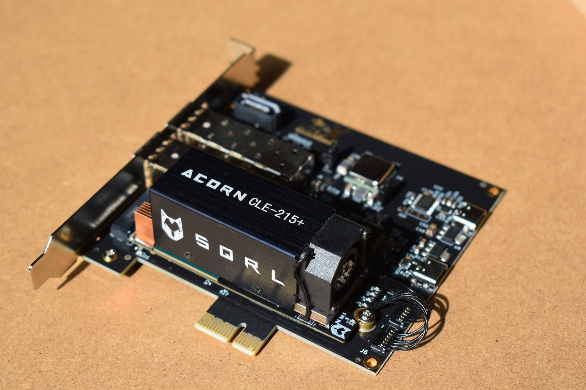
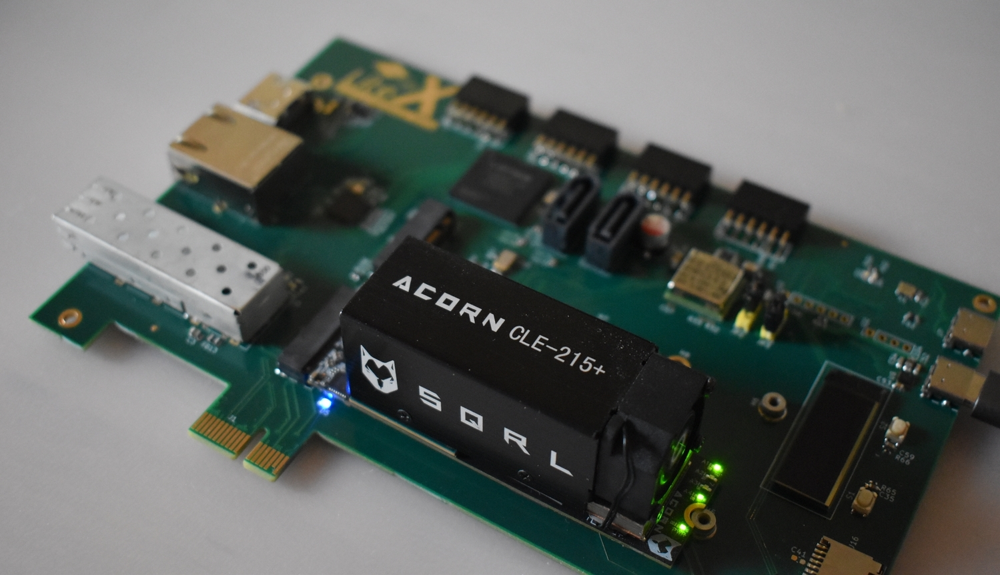

                                  __   _ __      _  __    ___
                                 / /  (_) /____ | |/_/___/ _ |_______  _______
                                / /__/ / __/ -_)>  </___/ __ / __/ _ \/ __/ _ \
                               /____/_/\__/\__/_/|_|__ /_/ |_\__/\___/_/ /_//_/
                                 / _ )___ ____ ___ / /  ___  ___ ________/ /
                                / _  / _ `(_-</ -_) _ \/ _ \/ _ `/ __/ _  /
                               /____/\_,_/___/\__/_.__/\___/\_,_/_/  \_,_/
                                    Copyright 2021-2026 / Enjoy-Digital

[](https://github.com/enjoy-digital/litex-acorn-baseboard/actions/workflows/ci.yml)

[](https://deepwiki.com/enjoy-digital/litex-acorn-baseboard)
[](https://enjoy-digital-shop.myshopify.com/products/litex-acorn-baseboard-mini)

[> Intro
--------

The LiteX-Acorn-Baseboards are baseboards developed around the SQRL Acorn card (and the compatible
RHS Research LiteFury/NiteFury), extending their possibilities with additional connectivity and I/Os.
Two variants exist:

**Mini variant** — commercialized, available on our [webshop][webshop]:



- An M.2 connector for the Acorn/LiteFury/NiteFury (or [LiteX-M2SDR][m2sdr]).
- A PCIe X1 connector.
- 2 SFP connectors.
- A SATA connector.
- 2 PicoEzMate connectors (GPIOs).
- 2 USB-C connectors: one for JTAG/UART (onboard FT2232H) and one for power (onboard 3.3V regulator).

**Standard variant** — internal development only, not commercialized:



- A PCIe X1 connector.
- An SFP connector.
- An M.2 SATA slot.
- An ECP5 FPGA (connected to the Acorn through a SerDes link) and providing:
  - A JTAG/UART port.
  - A 1Gbps Ethernet port (RGMII).
  - An HDMI Out port.
  - An SDCard slot.
  - 4 PMODs.
  - 2 Buttons.
  - An SSD1306 LCD.
  - 2 SATA connectors (connected to the ECP5's SerDeses).

The boards are primarily intended as development platforms for LiteX — from regression testing to
the development of new features — but they also make nice, affordable FPGA development boards for
anyone wanting to play with PCIe, SFP, SATA, etc., or to build standalone open-source Linux
platforms.

The development was specified and funded by [Enjoy-Digital][enjoy-digital] (@enjoy-digital), who
also did the HDL/gateware development. The schematic/PCB was designed by Ilia Sergachev
(@sergachev), who also assembled the initial prototypes.

[> Availability & Pricing
-------------------------

The **Mini variant** is produced in small batches and available on our webshop:

- Baseboard alone: https://enjoy-digital-shop.myshopify.com/products/litex-acorn-baseboard-mini
- Baseboard + SQRL Acorn CLE215 bundle:
  https://enjoy-digital-shop.myshopify.com/products/litex-acorn-baseboard-mini-sqrl-acorn-cle215

The **Standard variant** is currently used for internal R&D; no decision has been made yet about
producing it commercially.

The aim of the boards is to enable new kinds of designs with LiteX and to make it easier for users
to experiment with the framework and eventually contribute. **We produce and sell them to help
others have fun with LiteX/SerDes-based cores more than to make a living**, so batches are of
limited size and still partly assembled by hand. We try to stay responsive, but **there can be a
delay between batches (~1 month) and a few days between order and shipment**.

[> Getting Started
------------------

### Prerequisites
- Python 3.
- Xilinx Vivado (for the Acorn's Artix-7 FPGA).
- [openFPGALoader](https://github.com/trabucayre/openFPGALoader) (for flashing; also used by [`flash.py`](flash.py)).
- JTAG HS2 cable, or any OpenOCD-compatible cable (not needed for SPI-flash loading over PCIe).

### Installing LiteX
```sh
$ wget https://raw.githubusercontent.com/enjoy-digital/litex/master/litex_setup.py
$ chmod +x litex_setup.py
$ sudo ./litex_setup.py init install
```
... or follow the installation instructions from the LiteX Wiki:
https://github.com/enjoy-digital/litex/wiki/Installation

### First-time flashing (fresh Acorn card)
SQRL Acorn cards ship with their SPI flash write-protected (legacy fallback from their
crypto-mining firmware). [`flash.py`](flash.py) automates the unlock + flash procedure using
`openFPGALoader` only:
```sh
$ ./flash.py --unprotect            # one-time: lift the flash write protection
$ ./flash.py --flash                # flash the default bitstream (prebuilt/litex_acorn_baseboard_mini.bin)
$ ./flash.py --unprotect --flash    # or do both in one go
$ ./flash.py --flash --bitstream my_design.bin   # flash your own bitstream
```
The default bitstream in [`prebuilt/`](prebuilt/) is the one we pre-load on boards shipped from the
webshop — a LiteX SoC with PCIe / Ethernet / SATA support, useful as a sanity check that the board
is alive before flashing your own design.

### First build (Mini variant)
A good starting point is the LiteX-Boards target, which covers SoC / DRAM / PCIe / Ethernet / SATA:
```sh
$ cd litex-boards/litex_boards/targets/
$ ./litex_acorn_baseboard_mini.py --with-pcie --build --load
```
See [Designs & Apps](#-designs--apps) below for more involved examples (Linux, PTP, SerDes…).

[> Repository Layout
--------------------

### Schematics — [`hardware/`](hardware/)
- [`acorn-baseboard-mini-2022-06-06.pdf`](hardware/acorn-baseboard-mini-2022-06-06.pdf) — Mini
  variant schematic.
- [`acorn-baseboard-2021-07-02.pdf`](hardware/acorn-baseboard-2021-07-02.pdf) — Standard variant
  schematic.
- [`acorn.pdf`](hardware/acorn.pdf) — SQRL Acorn card schematic (for reference).

### Bring-up tests — [`bringup/`](bringup/)
Small, self-contained LiteX designs used to validate each sub-system. They are a good source of
minimal examples when you want to reproduce only one feature.

**Mini variant** — [`bringup/mini/`](bringup/mini/):
- [`acorn_litex_soc/`](bringup/mini/acorn_litex_soc/) — Minimal LiteX SoC (BIOS over JTAG-UART).
- [`acorn_pcie/`](bringup/mini/acorn_pcie/) — PCIe Gen2 X1 bring-up.
- [`acorn_serdes/`](bringup/mini/acorn_serdes/) — SerDes PRBS/BER test (PCIe and SFP loopback).
- [`acorn_sfp_eth_1000basex/`](bringup/mini/acorn_sfp_eth_1000basex/) — 1000BASE-X Ethernet over SFP.
- [`acorn_sfp_eth_2500basex/`](bringup/mini/acorn_sfp_eth_2500basex/) — 2500BASE-X Ethernet over SFP.

**Standard variant** — [`bringup/standard/`](bringup/standard/):
- [`acorn_pcie/`](bringup/standard/acorn_pcie/), [`acorn_sata/`](bringup/standard/acorn_sata/),
  [`acorn_sfp_eth_1gbps/`](bringup/standard/acorn_sfp_eth_1gbps/) — Acorn-side peripherals.
- [`acorn_ecp5_link/`](bringup/standard/acorn_ecp5_link/),
  [`acorn_i2c_ecp5/`](bringup/standard/acorn_i2c_ecp5/) — Acorn ↔ ECP5 link and I²C boot control.
- [`ecp5_eth_1gbps/`](bringup/standard/ecp5_eth_1gbps/),
  [`ecp5_hdmi_out/`](bringup/standard/ecp5_hdmi_out/),
  [`ecp5_lcd/`](bringup/standard/ecp5_lcd/),
  [`ecp5_sdcard/`](bringup/standard/ecp5_sdcard/) — ECP5-side peripherals.

[> Designs & Apps
-----------------

The Mini variant is supported across the LiteX ecosystem; good entry points include:

- **LiteX-Boards** — reference SoC target with SoC / DRAM / PCIe / Ethernet / SATA support:
  https://github.com/litex-hub/litex-boards/blob/master/litex_boards/targets/litex_acorn_baseboard_mini.py
- **Linux-on-LiteX-VexRiscv** — run Linux on a VexRiscv SoC (`--board=acorn_baseboard_mini`):
  https://github.com/litex-hub/linux-on-litex-vexriscv
- **LiteX-HW-CI** — Linux regression tests on the board with VexRiscv, NaxRiscv (32/64-bit) or Rocket:
  https://github.com/enjoy-digital/litex_hw_ci/blob/main/configs/test_linux_acorn.py
- **LiteEth** — PTP bench on the board:
  https://github.com/enjoy-digital/liteeth/blob/master/bench/acorn_baseboard_mini_ptp.py
- **LiteICLink** — SerDes PRBS/BER bench on the SQRL Acorn (usable standalone or through the Mini):
  https://github.com/enjoy-digital/liteiclink/blob/master/bench/serdes/sqrl_acorn.py
- **LitePCIe** — PCIe bench on the SQRL Acorn:
  https://github.com/enjoy-digital/litepcie/blob/master/bench/acorn.py
- **LiteSATA** — SATA bench on the SQRL Acorn:
  https://github.com/enjoy-digital/litesata/blob/master/bench/acorn.py

... and more to come. :)

[> Validation Status
--------------------

**Mini variant:**
- [x] PCIe Gen2 X1.
- [x] JTAG.
- [x] UART.
- [x] SFPs.
- [x] SATA.

**Standard variant:**
- [x] PCIe Gen2 X1.
- [x] SFP.
- [x] M.2 SATA SSD.
- [x] ECP5 JTAG/UART.
- [x] Acorn JTAG.
- [ ] Acorn/ECP5 Fast Link.
- [x] Acorn/ECP5 Slow Link (2 of 4 lanes tested).
- [x] ECP5 boot control from Acorn via I²C.
- [x] 1Gbps Ethernet.
- [x] HDMI Out.
- [x] SDCard.
- [x] 4× PMODs.
- [x] 2× Buttons.
- [x] SSD1306 LCD.
- [ ] 2× ECP5 SATA.

[> Contact
----------
E-mail: florent@enjoy-digital.fr

[webshop]: https://enjoy-digital-shop.myshopify.com/
[enjoy-digital]: https://enjoy-digital.fr
[m2sdr]: https://github.com/enjoy-digital/litex_m2sdr
