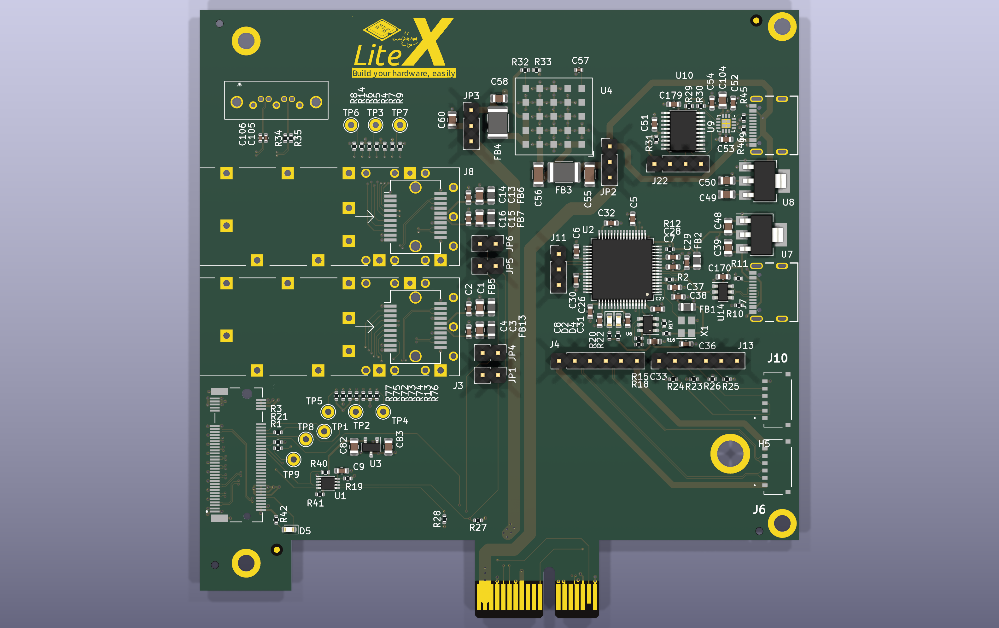

[> LiteX-Acorn-Baseboard-Mini: Connectors & Jumpers
---------------------------------------------------

Connectors/jumpers reference for the Mini variant, extracted from the
[schematic](acorn-baseboard-mini-2022-06-06.pdf). See the [top render](acorn-baseboard-mini-top.png)
to locate the references on the PCB (positions below are given with the PCIe edge connector at the
bottom, as in the render).

[> Connectors
-------------

| Ref | Description                                  | Notes                                                                                     |
|-----|----------------------------------------------|-------------------------------------------------------------------------------------------|
| J1  | PCIe X1 Gen2 card edge.                      | Also provides +12V/+3.3V power (see JP2/JP3) and SMBus (see JP1/JP4/JP5/JP6).             |
| J2  | M.2 key M socket.                            | For the SQRL Acorn / LiteFury / NiteFury (or LiteX-M2SDR).                                |
| J3  | SFP0 cage (bottom one, closest to the M.2).  | `sfp0` in the gateware.                                                                   |
| J8  | SFP1 cage (top one, closest to the SATA).    | `sfp1` in the gateware.                                                                   |
| J5  | SATA connector.                              |                                                                                           |
| J7  | USB-C (bottom one): JTAG/UART.               | Onboard FTDI chip (FT2232H/FT4232H depending on the revision). Also powers the FTDI chip. |
| J9  | USB-C (top one): Power input.                | USB Power-Delivery (FUSB302 + STM32 U10). Main power input when not in a PCIe slot.      |
| J10 | Pico-EZmate 6-pin: Acorn JTAG.               | Connect to the Acorn JTAG connector with a Pico-EZmate 6 cable.                           |
| J6  | Pico-EZmate 6-pin: Acorn I/O (P2).           | Connect to the Acorn P2 connector with a Pico-EZmate 6 cable.                             |
| J4  | 2.54mm 6-pin header: Acorn I/O breakout.     | Same signals as J6 (pin to pin).                                                          |
| J13 | 2.54mm 6-pin header: External JTAG.          | Shared with the onboard FTDI JTAG and J10, for an external JTAG cable (ex Digilent HS2).   |
| J11 | 2.54mm 3-pin header: FTDI UART.              | UART also routed to the Acorn through the M.2 connector (no wiring needed).               |
| J22 | 2.54mm 4-pin header: STM32 (U10) SWD.        | USB-PD controller programming.                                                            |

### Pinouts

**J13 — External JTAG** (pin 6 = VDD, compatible with the Digilent HS2 pin order):

| Pin | 1   | 2   | 3   | 4   | 5   | 6    |
|-----|-----|-----|-----|-----|-----|------|
|     | TMS | TDI | TDO | TCK | GND | +3V3 |

**J10 — Acorn JTAG (Pico-EZmate)**:

| Pin | 1  | 2   | 3   | 4   | 5   | 6   |
|-----|----|-----|-----|-----|-----|-----|
|     | NC | TDI | TMS | TDO | TCK | GND |

**J4/J6 — Acorn I/O (P2)**:

| Pin | 1          | 2     | 3     | 4     | 5     | 6          |
|-----|------------|-------|-------|-------|-------|------------|
|     | Acorn P2.1 | AIO1N | AIO1P | AIO2N | AIO2P | Acorn P2.6 |

**J11 — FTDI UART** (FTDI channel B, LiteX `serial` on the Acorn):

| Pin | 1                    | 2                    | 3   |
|-----|----------------------|----------------------|-----|
|     | FTDI TX (-> FPGA RX) | FTDI RX (<- FPGA TX) | GND |

The UART is routed to the Acorn through the M.2 connector (FTDI TX -> M.2 SMB_ALERT#, M.2
CLKREQ# -> FTDI RX) so J11 is only needed to monitor or connect to the UART externally.

**J22 — STM32 SWD**:

| Pin | 1      | 2     | 3     | 4   |
|-----|--------|-------|-------|-----|
|     | +3.3VA | SWCLK | SWDIO | GND |

[> Jumpers
----------

| Ref | Function                                       | Setting                                                                                                   |
|-----|------------------------------------------------|-----------------------------------------------------------------------------------------------------------|
| JP2 | 1st power input selector: DC/DC (U4) input.    | 1-2: from USB-C J9 (VBUS). 2-3: from PCIe edge connector (+12V).                                          |
| JP3 | 2nd power input selector: Baseboard +3V3 rail. | 1-2: from onboard 3.3V DC/DC (U4, also powering the M.2/Acorn). 2-3: from PCIe edge connector (+3.3V).    |
| JP1 | SFP0 I2C SCL <-> PCIe/M.2 SMBus SCL.           | Close to access SFP0 I2C (module EEPROM/DDM).                                                             |
| JP4 | SFP0 I2C SDA <-> PCIe/M.2 SMBus SDA.           | Close to access SFP0 I2C (module EEPROM/DDM).                                                             |
| JP5 | SFP1 I2C SCL <-> PCIe/M.2 SMBus SCL.           | Close to access SFP1 I2C (module EEPROM/DDM).                                                             |
| JP6 | SFP1 I2C SDA <-> PCIe/M.2 SMBus SDA.           | Close to access SFP1 I2C (module EEPROM/DDM).                                                             |

Notes:
- The Acorn (M.2) is always powered from the onboard 3.3V DC/DC (U4), so JP2 has to be set in all
  cases: 1-2 when powered from USB-C J9 (standalone), 2-3 to use the PCIe +12V when in a PCIe slot.
- The SFP I2C buses are connected to the PCIe SMBus and, through a PCA9306 level-shifter (U1), to
  the M.2 SMBus (`sfp_i2c` in the gateware). Since SFP modules all use the same I2C addresses
  (0x50/0x51), only close the jumpers of one SFP at a time (JP1+JP4 for SFP0 or JP5+JP6 for SFP1).
